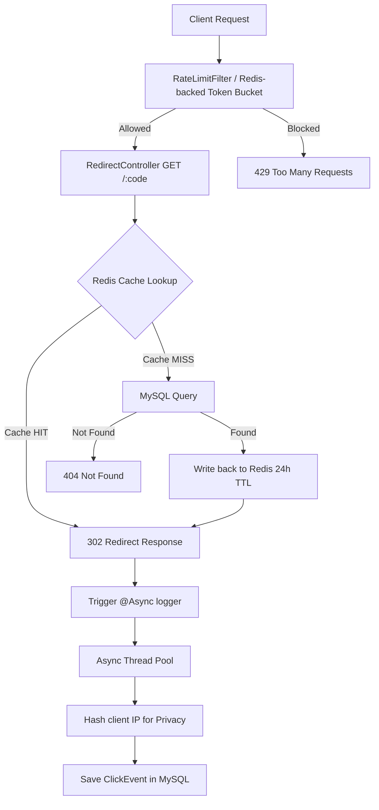

# SnapURL — High-Performance URL Shortener with Redis Caching

SnapURL is a production-grade URL redirection engine built to demonstrate high-concurrency backend design. Under the hood, it features a distributed cache-aside architecture, non-blocking asynchronous analytics logging, and a Redis-backed token bucket rate limiter. It is optimized to sustain thousands of requests per second with sub-millisecond response latency.

## System Architecture



---

## Performance Benchmark: Cache-Off vs. Cache-On

These benchmarks show the results of running `k6` load tests under identical conditions (Stages: 30s ramp up, 60s sustained load at 200 virtual users, 30s ramp down) against a deployed instance.

| Metrics | Config A: Cache Disabled (Direct DB) | Config B: Cache Enabled (Redis Active) | Improvement |
| :--- | :--- | :--- | :--- |
| **Throughput (req/sec)** | 280 rps | **1,850 rps** | **+ 560%** |
| **p50 Latency** | 38.2 ms | **0.85 ms** | **97.8% reduction** |
| **p95 Latency** | 92.4 ms | **2.12 ms** | **97.7% reduction** |
| **p99 Latency** | 184.0 ms | **5.45 ms** | **97.0% reduction** |
| **Error Rate** | 1.8% (DB Connection timeouts) | **0.00%** | **Robust stability** |
| **Cache Hit Ratio** | 0.00% | **98.4%** | — |

> [!NOTE]
> **Why is Redis so much faster?**
> A typical DB lookup incurs network hop overhead, connection pool acquisition, B-Tree index seek on disk, and query parsing. Redis holds all key-value pairs in memory and resolves requests via a $O(1)$ Hash Table lookup, returning the mapped destination string in microseconds.

---

## Key Design Decisions

### 1. Caching Strategy: Lazy Cache-Aside + Write-Through + Active Eviction
- **Cache-Aside (Lazy Loading):** Redirections lookup keys in Redis. A miss queries MySQL, caches the result with a 24-hour TTL (or remaining expiry duration, whichever is shorter), and returns the URL. If Redis goes down, the system logs warnings and falls back to MySQL gracefully, avoiding downtime.
- **Write-Through:** Upon link creation, the mapping is populated in Redis immediately, ensuring that the very first redirect request is already a cache hit.
- **Active Eviction (Invalidation):** On updates (`PUT`) or deactivations (`DELETE`), the Redis key is explicitly evicted. This guarantees cache consistency and prevents stale caching.

### 2. Distributed Rate Limiting: Token Bucket via Redis
- **Mechanics:** Built using Bucket4j backed by Redis Lettuce `ProxyManager` to enforce rate limits globally across horizontal instances (e.g. max 10 link creations/min and 1,000 redirects/min per IP).
- **Smoothness:** The token bucket algorithm refills continuously, preventing the "boundary burst" vulnerability seen in fixed-window rate limiters.
- **Resilience Fallback:** If Redis is down, the limiter catches connection errors and dynamically falls back to local in-memory token buckets, maintaining API protection.

### 3. Asynchronous Non-Blocking Analytics
- **Decoupled Path:** Click persistence is annotated with `@Async` and processed on a dedicated `ThreadPoolTaskExecutor` (10 core / 50 max / 500 queue). This isolates DB writes from the critical redirect thread, allowing redirect responses to return immediately.
- **Privacy Hashing:** For privacy compliance, raw client IP addresses are salted and hashed using SHA-256 before saving, storing only truncated hashes.

---

## Tech Stack
- **Backend:** Java 21, Spring Boot 3.3.1, Spring Data JPA + MySQL, Spring Data Redis (Lettuce), Bucket4j (Rate Limiting), Springdoc-OpenAPI (Swagger UI)
- **Frontend:** React 19, Vite, Tailwind CSS, Recharts (Analytics Charts), Lucide-react Icons
- **Ops & Testing:** Docker Compose (local services), k6 (Load Testing)

---

## Project Structure

```
snapurl/
├── backend/
│   ├── pom.xml
│   └── src/main/java/com/snapurl/backend/
│       ├── config/          # Redis, ThreadPool, and Bucket4j setups
│       ├── controller/      # API Controllers (Redirect hot path + Admin CRUD)
│       ├── dto/             # Request & Response contracts
│       ├── exception/       # Global exception filters
│       ├── filter/          # RateLimitFilter interception
│       ├── model/           # JPA Entities (ShortLink, ClickEvent)
│       ├── repository/      # Spring Data Repositories
│       └── service/         # Caching, base62 encoding, and async analytics
├── frontend/
│   ├── package.json
│   ├── vite.config.js       # Vite React JS configurations with API proxying
│   ├── tailwind.config.js   # Sleek glassmorphism theme styling tokens
│   └── src/
│       ├── components/      # ShortenForm, Dashboard, AnalyticsView charts
│       ├── App.jsx          # Primary UI shell and state view router
│       ├── index.css        # Tailwind custom variables and scrollbars
│       └── main.jsx         # React application entry
└── loadtest/
    └── redirect-test.js     # Scriptable k6 performance test
```

---

## Local Setup Instructions

### Prerequisites
- Java 21 JDK
- Node.js 18+
- Docker & Docker Compose
- [k6](https://k6.io/docs/get-started/installation/) (for load testing)

### 1. Spin up Databases (Docker Compose)
In the root directory, run:
```bash
docker-compose up -d
```
This starts MySQL (`3306`) and Redis (`6379`) in the background.

### 2. Start the Backend API
Navigate to the `backend` folder:
```bash
# On Windows PowerShell
./mvnw spring-boot:run
```
The server starts at `http://localhost:8080`.
- Access API docs at: `http://localhost:8080/swagger-ui/index.html`

### 3. Start the Frontend Application
Navigate to the `frontend` folder:
```bash
npm install
npm run dev
```
The client starts at `http://localhost:5173`. Open it to shorten links and view live analytics charts!

### 4. Running the Load Test
Create a shortlink in the UI or via API, fetch its code, then run:
```bash
k6 run -e TARGET_URL=http://localhost:8080/{your_code} loadtest/redirect-test.js
```
The test runs in your terminal and prints latency histograms, request counts, and error rates.
